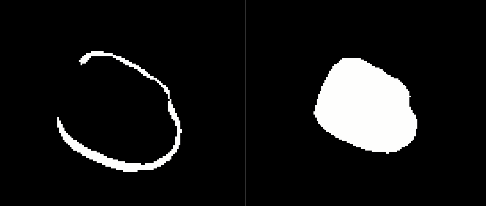
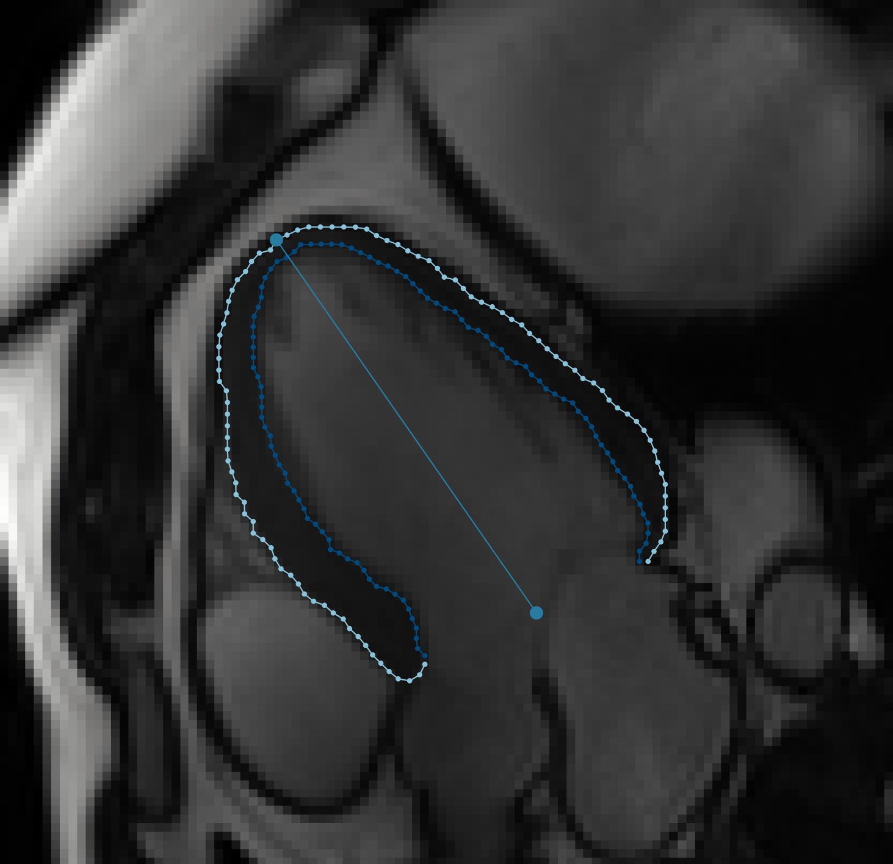

# VentricleContouring

*Author: Rylan Marianchuk*
*February 2022*

Python >= 3.7 required.
Package dependencies:
```
numpy
```
Optional package dependencies for output/debug visualization and image viewing:
```
plotly
imageio
```

Given two binary masks as ndarrays: 
* ```lumen_mask``` places 1 throughout the ventricle volume
* ```myo_mask``` places 1 on the myocardium (lining the ventricle)



*Myocardiam mask (left), Solid lumen mask (right)*

The endocardium and epicardium contours, in addition to the apex, can be obtained from these masks by calling the ``MaskToContour()`` object:
```
GetContour = MaskToContour()
endo, epi, apex = GetContour(solid_mask, myo_mask)
```

See the docstring in below (duplicated in from ``__call__()``) in addition to ``__init__()``  for specfic shapes and dtypes and optional parameters to invoke.

```
__call__():
"""
Obtain the contours of epicaridum, endocardium, and the location of the apex, and quality parameters given the binary masks

:param lumen_mask:  (ndarray), shape=(N, M), dtype=int
                    1 assigned to every pixel within the blood volume of the ventricle (lumen), 0 elsewhere
:param myo_mask:    (ndarray), shape=(N, M), dtype=int
                    1 assigned to only pixels on the lining of the ventricle (myocardium), 0 elsewhere
:param img_overlay: (ndarray), shape=(N, M), dtype=uint16, MRI derived initial image before segmentation
:param out_name:    (str) the filename to save the overlayed contour image as

:return --

endo_contour:   (ndarray), shape=(self.pointCloudDensity, 2) ordered, each row is a coordinate of the equidistant
                endocardium contour
epi_contour:    (ndarray), shape=(self.pointCloudDensity, 2) ordered, each row is a coordinate of the equidistant
                epicardium contour
apex:           (ndarray), shape=(2,) the coordinate of the apex, lying on the epicardium contour
quality:        (dict) a collection of statistics populated during contour generation:
    -  endo_equidist     the distance between all points in the endo_contour
    -  epi_equidist      the distance between all points in the epi_contour
    -  loops_left        10 - times needed to move epi_contour due to distance clashes (too close)
    -  prop_first_flood  percentage of 1's filled on the myocardium mask when flood filling from an arbitrary 1 start
    -  start_phi         the angle in radians from initial arm centroid -> (1, 0) to terminal arm centroid -> endo_contour[0]
    -  end_phi           the angle in radians from initial arm centroid -> (1, 0) to terminal arm centroid -> endo_contour[-1]
    -  epi_moved_dist    the total distance (1 unit is 1 pixel) of all points moved automatically in the epi_contour due to distance clashes
    -  epi_moved_count   the total number of all points moved automatically in the epi_contour due to distance clashes (not unique, can include duplicate points over iterations)
"""
```
See ```main.py``` for code that reads in masks and executes the transform on a .png image.

Constraints:
* Contours are equi-distant
* Endo and Epi countours shall never cross
* Any endo point will always be at least 1 unit away from any epi point
* Invariant to ventricle rotation

*Example output of a contour density of 100 points, overlayed on MR image using the default parameters:*

```
GetContour = MaskToContour(debug=True, dPhi=0.01, dR=0.5, contourDensity=100)
endo, epi, apex = GetContour(solid_mask, myo_mask)
```

